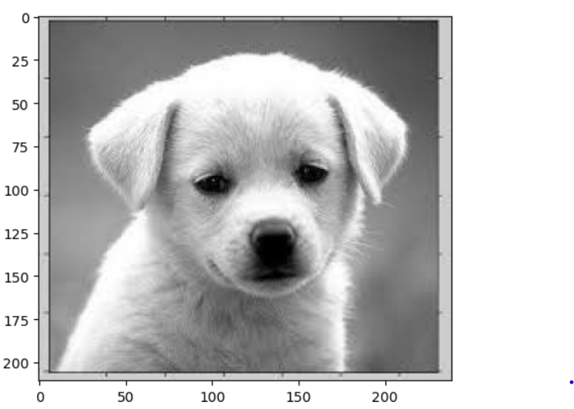
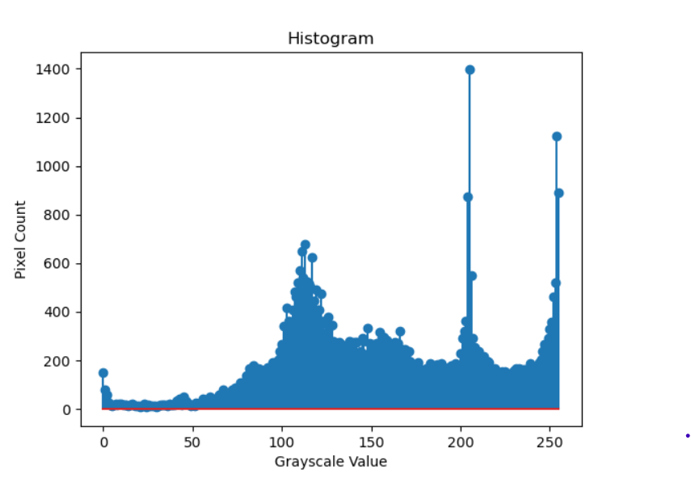
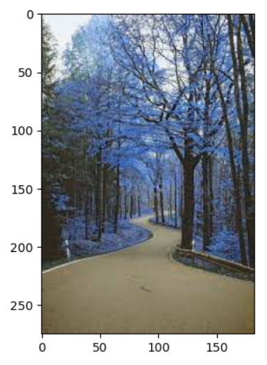
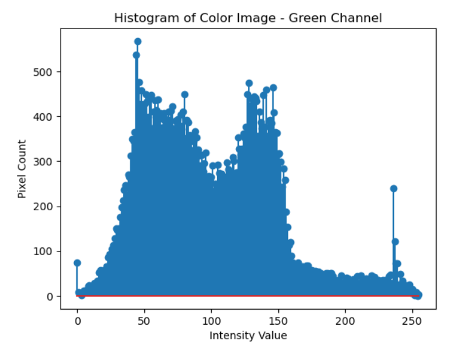

# Histogram-of-an-images
## Aim
To obtain a histogram for finding the frequency of pixels in an Image with pixel values ranging from 0 to 255. Also write the code using OpenCV to perform histogram equalization.

## Software Required:
Anaconda - Python 3.7

## Algorithm:
### Step1:
Read the gray and color image using imread()

### Step2:
Print the image using imshow().


### Step3:
Use calcHist() function to mark the image in graph frequency for gray and color image.

### step4:
Use calcHist() function to mark the image in graph frequency for gray and color image.

### Step5:
The Histogram of gray scale image and color image is shown.


## Program:

### Developed By: Praveen D
### Register Number: 212222240076

### Grayscale image and Color image
```
import cv2
import matplotlib.pyplot as plt
gray_image = cv2.imread("gray.jpeg")
color_image = cv2.imread("dip.jpeg",-1)
cv2.imshow("Gray Image",gray_image)
cv2.imshow("Colour Image",color_image)
cv2.waitKey(0)
cv2.destroyAllWindows()
```
### Histogram of Grayscale image 
```
import numpy as np
import cv2
Gray_image = cv2.imread("gray.jpeg")
Color_image = cv2.imread("dip.jpeg")
import matplotlib.pyplot as plt
gray_hist = cv2.calcHist([Gray_image],[0],None,[256],[0,256])
color_hist = cv2.calcHist([Color_image],[0],None,[256],[0,256])
plt.figure()
plt.imshow(Gray_image)
plt.show()
plt.title("Histogram")
plt.xlabel("Grayscale Value")
plt.ylabel("Pixel Count")
plt.stem(gray_hist)
plt.show()
```
### Histogram of Color image
```
plt.imshow(Color_image)
plt.show()
plt.title("Histogram of Color Image - Green Channel")
plt.xlabel("Intensity Value")
plt.ylabel("Pixel Count")
plt.stem(color_hist)
plt.show()
cv2.waitKey(0)
```
### Histogram equalization of Grayscale image
```

import cv2
gray_image = cv2.imread("dip.jpeg",0)
cv2.imshow('Grey Scale Image',gray_image)
equ = cv2.equalizeHist(gray_image)
cv2.imshow("Equalized Image",equ)
cv2.waitKey(0)
cv2.destroyAllWindows()
```


## Output:
### Input Grayscale Image and Color Image


### Histogram of Grayscale Image and any channel of Color Image
### Grayscale image
  

### Color image
  

### Histogram Equalization of Grayscale Image.


## Result: 
Thus the histogram for finding the frequency of pixels in an image with pixel values ranging from 0 to 255 is obtained. Also,histogram equalization is done for the gray scale image using OpenCV.
